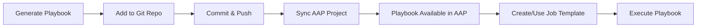

# Playbook Integration with AAP

## Overview

This guide explains how to integrate generated Ansible remediation playbooks with AAP (Ansible Automation Platform) through Git-based projects. AAP requires playbooks to be stored in version control (Git) and synced to projects before execution.

## Workflow Overview



## Git Repository Structure

### Recommended Directory Layout

```
ansible-remediation-playbooks/
├── README.md
├── .gitignore
├── playbooks/
│   ├── remediation/
│   │   ├── remediation-CVE-2025-49794.yml
│   │   ├── remediation-CVE-2025-50123.yml
│   │   └── remediation-template.yml
│   ├── verification/
│   │   └── verify-remediation.yml
│   └── rollback/
│       └── rollback-template.yml
├── roles/
│   ├── common/
│   ├── package-update/
│   └── service-restart/
├── inventories/
│   ├── production.ini
│   ├── staging.ini
│   └── development.ini
├── group_vars/
│   └── all.yml
└── host_vars/
```

**Key Directories**:
- `playbooks/remediation/` - CVE remediation playbooks
- `playbooks/verification/` - Post-remediation verification
- `playbooks/rollback/` - Rollback procedures
- `roles/` - Shared Ansible roles
- `inventories/` - Inventory files (optional if using AAP inventories)
- `group_vars/` and `host_vars/` - Variable files

### .gitignore Configuration

```gitignore
# Ansible
*.retry
.vault_pass
*.swp
*~

# Logs
*.log

# Credentials (NEVER commit)
**/credentials.*
**/secrets.*
**/.env

# Temporary files
/tmp/
.DS_Store
```

## Adding Playbooks to Git Repository

### Method 1: Existing Repository

If you already have a Git repository configured in AAP:

#### Step 1: Clone Repository (if not already local)

```bash
# Clone the repository
git clone https://github.com/your-org/ansible-remediation-playbooks.git
cd ansible-remediation-playbooks
```

#### Step 2: Add Generated Playbook

```bash
# Create remediation directory if it doesn't exist
mkdir -p playbooks/remediation

# Add the playbook (replace with actual content)
cat > playbooks/remediation/remediation-CVE-2025-49794.yml << 'EOF'
---
- name: Remediate CVE-2025-49794
  hosts: all
  become: true
  
  tasks:
    - name: Check disk space
      # ... playbook content ...
EOF
```

#### Step 3: Commit Changes

```bash
# Stage the new playbook
git add playbooks/remediation/remediation-CVE-2025-49794.yml

# Create descriptive commit message
git commit -m "Add remediation playbook for CVE-2025-49794

- Target CVE: CVE-2025-49794 (Critical, CVSS 9.8)
- Affected package: httpd
- Remediation: Update to httpd-2.4.57-8.el9
- Target systems: Production web servers
- Requires: Brief service restart (~10s downtime)
"
```

#### Step 4: Push to Remote

```bash
# Push to main branch (or your default branch)
git push origin main
```

#### Step 5: Sync AAP Project

**Via AAP Web UI**:
1. Navigate to **Automation Execution** → **Projects**
2. Find your project (e.g., "Remediation Playbooks")
3. Click the **Sync** button (🔄 icon)
4. Wait for status to change to "Successful" (green checkmark)
5. Verify playbook appears in project's playbook list

**Via AAP API** (if available):
```bash
curl -X POST \
  "${AAP_MCP_SERVER}/api/controller/v2/projects/${PROJECT_ID}/update/" \
  -H "Authorization: Bearer ${AAP_API_TOKEN}"
```

### Method 2: New Repository

If you need to create a new repository for remediation playbooks:

#### Step 1: Initialize Local Repository

```bash
# Create project directory
mkdir ansible-remediation-playbooks
cd ansible-remediation-playbooks

# Initialize Git
git init
```

#### Step 2: Create Directory Structure

```bash
# Create directory structure
mkdir -p playbooks/{remediation,verification,rollback}
mkdir -p roles
mkdir -p inventories
mkdir -p {group_vars,host_vars}
```

#### Step 3: Create README

```bash
cat > README.md << 'EOF'
# Ansible Remediation Playbooks

CVE remediation playbooks for Red Hat Enterprise Linux systems.

## Directory Structure

- `playbooks/remediation/` - CVE remediation playbooks
- `playbooks/verification/` - Post-remediation verification
- `playbooks/rollback/` - Rollback procedures
- `roles/` - Shared Ansible roles
- `inventories/` - Inventory files (if not using AAP inventories)

## Naming Convention

Remediation playbooks: `remediation-CVE-YYYY-NNNNN.yml`

## Usage

Playbooks are executed via AAP job templates. See internal documentation
for execution procedures.

## Best Practices

1. Always test in non-production first
2. Review playbook in dry-run (check) mode
3. Backup systems before remediation
4. Verify remediation success after execution
5. Document changes in commit messages
EOF
```

#### Step 4: Create .gitignore

```bash
cat > .gitignore << 'EOF'
*.retry
.vault_pass
*.swp
*~
*.log
**/credentials.*
**/secrets.*
**/.env
/tmp/
.DS_Store
EOF
```

#### Step 5: Add First Playbook

```bash
# Add your generated playbook
cat > playbooks/remediation/remediation-CVE-2025-49794.yml << 'EOF'
# [Your playbook content here]
EOF
```

#### Step 6: Initial Commit

```bash
# Stage all files
git add .

# Create initial commit
git commit -m "Initial commit: Add remediation playbooks structure

- Directory structure for remediation, verification, rollback
- README with project documentation
- .gitignore for security
- First remediation playbook: CVE-2025-49794
"
```

#### Step 7: Create Remote Repository

**On GitHub**:
1. Go to https://github.com/new
2. Enter repository name: `ansible-remediation-playbooks`
3. Choose visibility (Private recommended for security)
4. **Do NOT** initialize with README (you already have one)
5. Click "Create repository"
6. Copy the repository URL

**On GitLab**:
1. Go to "New Project"
2. Enter project name
3. Choose visibility
4. **Uncheck** "Initialize with README"
5. Create project
6. Copy the repository URL

#### Step 8: Connect and Push

```bash
# Add remote
git remote add origin <repository-url>

# Rename branch to main (if needed)
git branch -M main

# Push to remote
git push -u origin main
```

#### Step 9: Add Project to AAP

**Via AAP Web UI**:
1. Navigate to **Automation Execution** → **Projects**
2. Click **Add** button
3. Fill in project form:
   - **Name**: "Remediation Playbooks"
   - **Organization**: Select your organization
   - **Source Control Type**: Git
   - **Source Control URL**: `<repository-url>`
   - **Source Control Branch**: `main`
   - **Source Control Credential**: (if private repo)
4. Click **Save**
5. AAP will automatically sync
6. Wait for status "Successful"

## Project Sync Process

### Understanding Project Sync

**What Happens During Sync**:
1. AAP connects to Git repository
2. Fetches latest commits from specified branch
3. Downloads playbooks and related files
4. Updates project playbook list
5. Makes playbooks available for job templates

**Sync Triggers**:
- Manual: Click Sync button in AAP Web UI
- Automatic: Configured update interval (optional)
- Webhook: Git push triggers AAP sync (optional)
- Pre-launch: Job template can auto-sync before execution

### Sync Verification

**Check Sync Status**:
```bash
# Via MCP tool
projects_list(search="Remediation")

# Look for:
# - status: "successful"
# - scm_revision: Latest commit SHA
# - last_update_failed: false
```

**Verify Playbook Available**:
1. In AAP Web UI, go to Projects
2. Click on your project
3. View "Playbooks" tab
4. Confirm new playbook appears in list

### Troubleshooting Sync Issues

**Sync Failed - Authentication**:
```
Error: Authentication failed
```
**Cause**: Invalid or missing Git credentials
**Fix**: 
- Update Source Control Credential in project settings
- Verify credential has read access to repository
- For private repos, ensure SSH key or token is valid

**Sync Failed - Network**:
```
Error: Failed to connect to repository
```
**Cause**: Network connectivity issues or firewall
**Fix**:
- Verify repository URL is correct
- Check AAP server can reach Git server
- Review firewall rules

**Sync Failed - Branch Not Found**:
```
Error: Branch 'main' not found
```
**Cause**: Specified branch doesn't exist
**Fix**:
- Verify branch name in project settings
- Check repository has commits on that branch
- Update branch name to match repository

**Playbook Not Appearing**:
```
Sync successful but playbook not in list
```
**Cause**: Playbook not in correct path or format
**Fix**:
- Verify playbook is in repository root or subdirectory
- Check playbook has .yml or .yaml extension
- Ensure playbook is valid Ansible syntax
- Re-sync project after fixing

## Playbook Versioning Strategy

### Semantic Versioning for Playbooks

**Approach 1: Git Tags**
```bash
# Tag specific playbook versions
git tag -a remediate-CVE-2025-49794-v1.0 -m "Initial version"
git push origin remediate-CVE-2025-49794-v1.0

# Update for new version
git tag -a remediate-CVE-2025-49794-v1.1 -m "Fixed service restart timeout"
git push origin remediate-CVE-2025-49794-v1.1
```

**Approach 2: Filename Versioning**
```
playbooks/remediation/
├── remediation-CVE-2025-49794-v1.yml
├── remediation-CVE-2025-49794-v2.yml
└── remediation-CVE-2025-49794.yml  # Latest (symlink or copy)
```

**Approach 3: Branch-Based**
```bash
# Create feature branch for new playbook
git checkout -b remediate-cve-2025-49794

# Develop and test
git add playbooks/remediation/remediation-CVE-2025-49794.yml
git commit -m "Add CVE-2025-49794 remediation"

# Merge to main after testing
git checkout main
git merge remediate-cve-2025-49794
git push origin main
```

### Recommended Versioning Approach

**For Production**:
1. Use Git tags for major versions
2. Keep playbook filenames stable
3. Document changes in commit messages
4. Use branches for development/testing
5. Merge to main only after validation

**Version Format**:
```
CVE-{YEAR}-{NUMBER}-v{MAJOR}.{MINOR}

Examples:
- CVE-2025-49794-v1.0 (Initial release)
- CVE-2025-49794-v1.1 (Bug fix)
- CVE-2025-49794-v2.0 (Major changes)
```

## Best Practices

### Commit Message Guidelines

**Format**:
```
<type>: <short summary>

<detailed description>

<metadata>
```

**Example**:
```
feat: Add remediation playbook for CVE-2025-49794

- Target CVE: CVE-2025-49794 (Critical, CVSS 9.8)
- Affected package: httpd
- Remediation: Update to httpd-2.4.57-8.el9
- Target systems: Production web servers
- Impact: Brief service restart (~10s downtime)
- Tested on: RHEL 9.3, 9.4
- Validation: Passed dry-run on 50 staging systems

Refs: TICKET-12345
```

**Commit Types**:
- `feat:` - New playbook
- `fix:` - Bug fix in existing playbook
- `refactor:` - Code restructuring without behavior change
- `docs:` - Documentation updates
- `test:` - Test-related changes
- `chore:` - Maintenance tasks

### Security Best Practices

1. **Never Commit Credentials**:
   - Use AAP credential vault
   - Reference credentials via AAP, not in playbooks
   - Add credential files to .gitignore

2. **Sensitive Variables**:
   ```yaml
   # Bad - hardcoded password
   - name: Connect to database
     vars:
       db_password: "MyPassword123"
   
   # Good - reference AAP credential
   - name: Connect to database
     vars:
       db_password: "{{ lookup('env', 'DB_PASSWORD') }}"
   ```

3. **Audit Trail**:
   - Descriptive commit messages
   - Link to change tickets
   - Document testing performed
   - Tag production versions

### Code Review Process

**Before Merging to Main**:
1. **Syntax Validation**:
   ```bash
   ansible-playbook --syntax-check playbook.yml
   ```

2. **Linting**:
   ```bash
   ansible-lint playbook.yml
   ```

3. **Dry-Run Testing**:
   - Test on staging systems first
   - Run in check mode
   - Review output for errors

4. **Peer Review**:
   - Create pull request
   - Have colleague review changes
   - Address feedback
   - Approve and merge

## AAP Project Configuration

### Project Settings

**Optimal Configuration**:
```yaml
Name: Remediation Playbooks
Organization: Default
Source Control Type: Git
Source Control URL: https://github.com/org/ansible-remediation-playbooks.git
Source Control Branch: main
Source Control Credential: Git-ReadOnly-Credential

Options:
  Clean: Yes (remove local modifications)
  Delete: Yes (delete before sync)
  Track submodules: No (unless needed)
  Update Revision on Launch: Yes (auto-sync before jobs)
  
Update Cache Timeout: 0 (always fetch latest)
```

**Update on Launch**: 
- **Enabled**: AAP syncs project before each job launch
- **Pros**: Always uses latest playbook version
- **Cons**: Slight delay before job starts
- **Recommendation**: Enable for dynamic environments

### Multiple Projects Strategy

**Option 1: Single Project for All Playbooks**
```
Project: "Remediation Playbooks"
Contains: All remediation, verification, rollback playbooks
Pros: Simple management, single sync point
Cons: All teams share same repository
```

**Option 2: Separate Projects by Purpose**
```
Project: "CVE Remediation"
  - playbooks/remediation/

Project: "Verification Playbooks"
  - playbooks/verification/

Project: "Rollback Procedures"
  - playbooks/rollback/

Pros: Clear separation, different access controls
Cons: More complex, multiple syncs needed
```

**Option 3: Separate Projects by Team/Environment**
```
Project: "Production Remediation"
  - Branch: main

Project: "Staging Remediation"
  - Branch: staging

Project: "Development Remediation"
  - Branch: develop

Pros: Environment isolation, safe testing
Cons: Need to promote across branches
```

## Automation and CI/CD Integration

### Automated Testing Pipeline

**Example GitHub Actions**:
```yaml
name: Playbook Validation

on:
  push:
    branches: [ main, develop ]
    paths:
      - 'playbooks/**/*.yml'
  pull_request:
    branches: [ main ]

jobs:
  validate:
    runs-on: ubuntu-latest
    steps:
      - uses: actions/checkout@v3
      
      - name: Install Ansible
        run: |
          pip install ansible ansible-lint
      
      - name: Syntax Check
        run: |
          ansible-playbook --syntax-check playbooks/**/*.yml
      
      - name: Ansible Lint
        run: |
          ansible-lint playbooks/
      
      - name: Check for Secrets
        run: |
          git secrets --scan
```

### Webhook Integration

**Trigger AAP Sync on Git Push**:

1. **Configure Webhook in Git**:
   - URL: `https://aap.example.com/api/controller/v2/projects/{id}/github/`
   - Events: Push events
   - Secret: Generate in AAP

2. **Enable Webhook in AAP**:
   - Project settings → Enable Webhook
   - Copy webhook URL and secret
   - Add to Git repository settings

**Result**: Git push automatically triggers AAP project sync.

## Related Documentation

- [AAP Job Execution Guide](./aap-job-execution.md) - Executing playbooks in AAP
- [CVE Remediation Templates](./cve-remediation-templates.md) - Playbook patterns
- [Package Management](../rhel/package-management.md) - RHEL package updates
